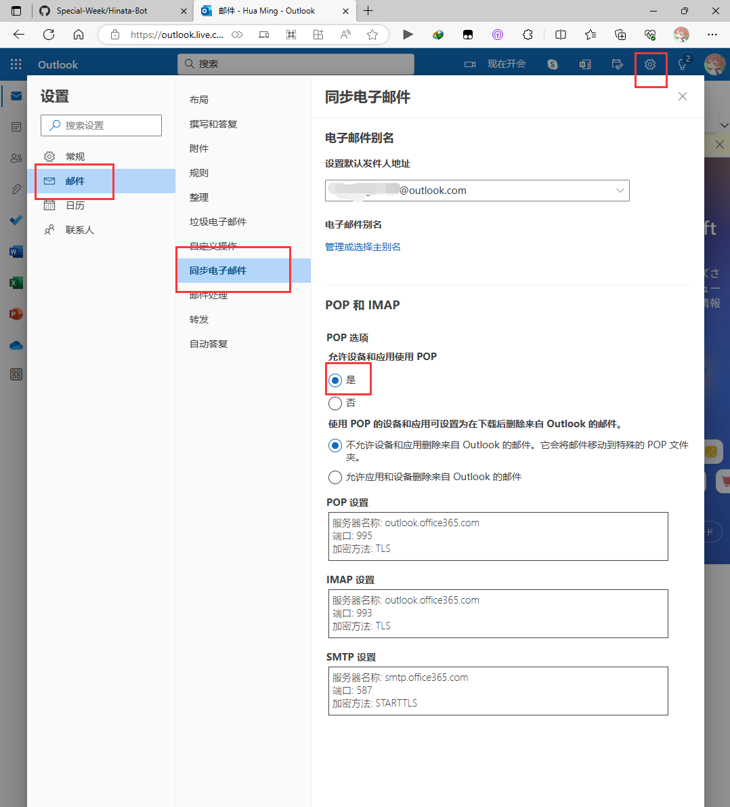
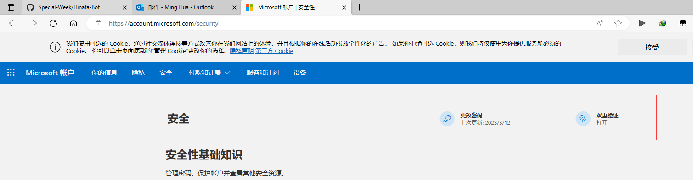
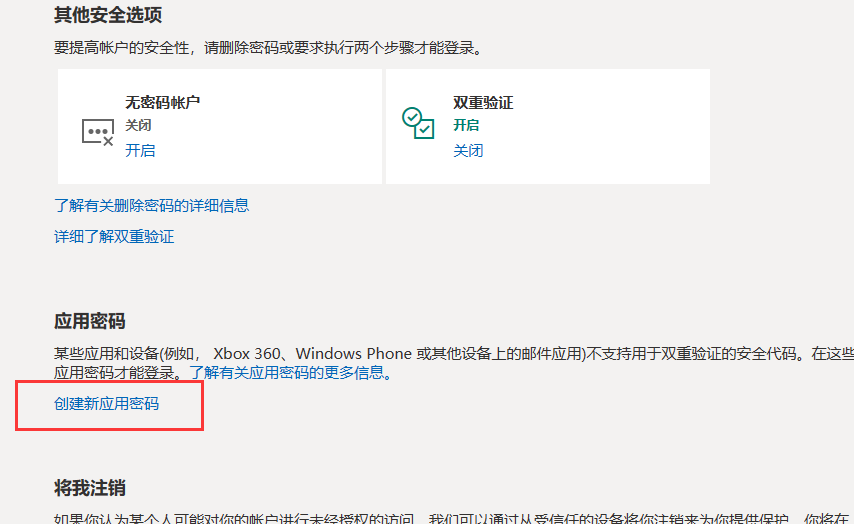
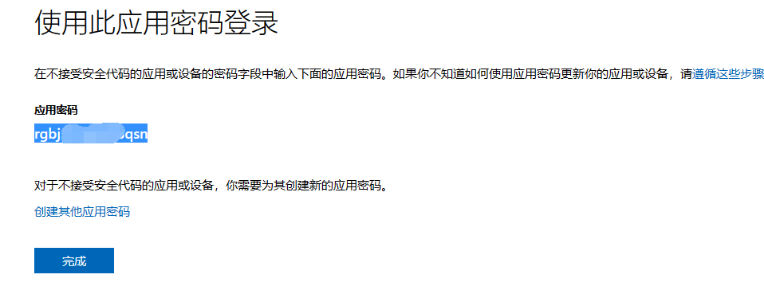

# nonebot2 bot掉线邮件提醒

## 目前暂时只能用作outlook邮箱

### 使用方法
env配置项:
```env
sender_email = "发送者邮箱"
sender_password = "发送者邮箱密码"
receiver_email = "接收者邮箱"
retry_count = 3 # 重试次数
```
其中 retry_count 可选，其余不填无法正常使用

### warning
密码并非你的邮箱密码，而是授权码
举例： 
- 网页登录你的outlook邮箱设置如图</br>
</br>
- 进入我的Microsoft账户，点击上方“安全”选项
- 打开双重验证</br>
</br>
- 创建新应用密码!</br>
</br>
</br>
这个密码才是作为你邮箱登录的密码
