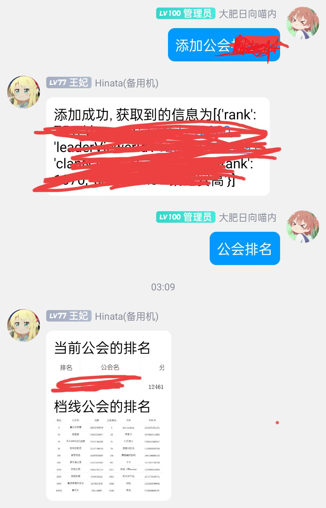
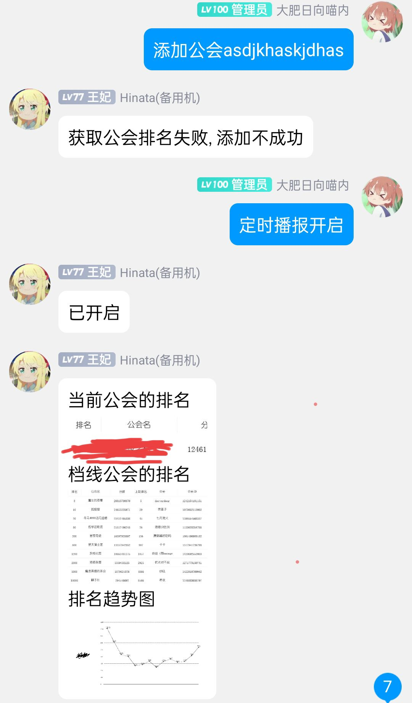

# pcr公会排名播报

## Env配置项
    guild_default_switch
    interval

其中:

    guild_default_switch是播报开关， 默认为True，
    interval是播报间隔，单位为hour, 默认为5

## Tips
- 默认加载进去是什么都不播报的，首先使用添加公会指令绑定你的工会在群聊， eg: 添加公会 桜之秋猫猫乐园
- 然后bot会回复你“添加成功, 获取到的信息为xxx”, 如果名字不对的话，“获取公会排名失败, 添加不成功”
- 删除公会 指令同理
- 使用 公会排名 指令会播报当前排名
- 使用 “定时” 或者 “播报” 后面带有 “取消”、“关闭” 或 “开启” 、“打开”指令会开启定时播报， 并且会立即执行一次
- 使用 "清除排名数据" 指令会清除该群组用来画折线图的排名数据， 但是不会清除公会绑定数据

## 效果图

