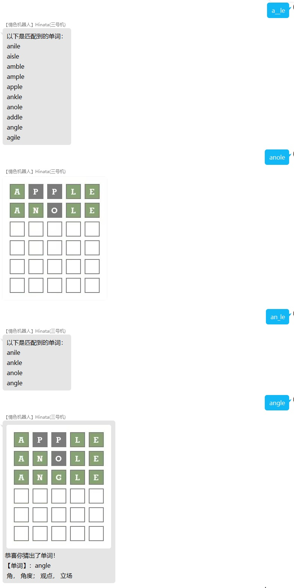
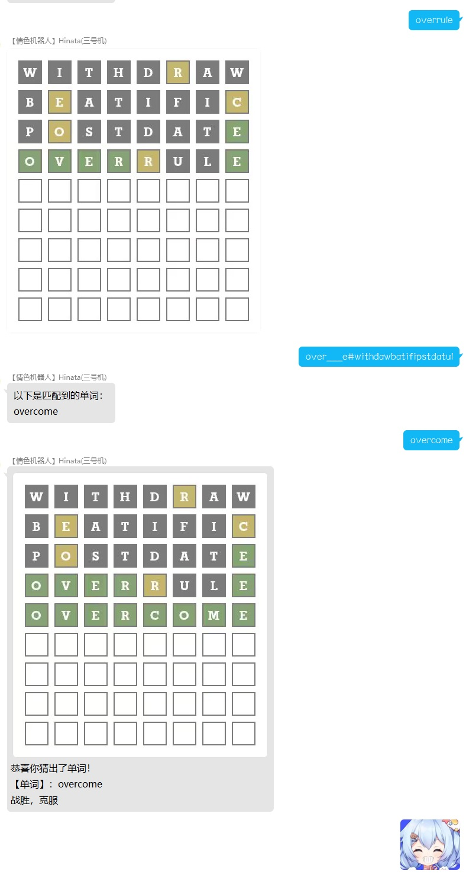

# wordle小游戏的帮助工具
搭配插件 https://github.com/noneplugin/nonebot-plugin-wordle 一起食用效果最佳

### 安装方式:

    nb plugin install nonebot-plugin-wordle-help
    pip install nonebot-plugin-wordle-help

## 功能预览

##### ------------------------------------------分割线-----------------------------------

## 命令
    r'^(?=.*[a-zA-Z])(?=.*_)[a-zA-Z_]+(#(?=[a-zA-Z]+$)[a-zA-Z]*)?$'
    此插件通过以上的正则表达式进行响应器匹配.

## 命令说明

    匹配由下划线和英文字母的消息, 并且需要至少存在一个英文字母与下划线. 

    后面有一个可选的井号, 在有井号时前面一半匹配规则如上, 后面则是一串英文字母.

    前面由下划线和英文字母组成的部分, 下划线代表未知字母, 英文字母代表已知字母.

    井号后的内容为你想找的单词中不存在的字母, 用于筛选单词.
